<h1 align="center" style="border-bottom: none; margin-bottom: 5px; padding: 0;">Hi 👋, I'm Casper Zielinski</h1>

<h3 align="center">Not waiting for the future — creating it.</h3>

<h4 >
  Ich bin ein <strong>Frontend/Web Developer</strong> und studiere an der 
  <strong>FH Joanneum</strong> mit Fokus auf moderne Webtechnologien. 
  Ich entwickle benutzerfreundliche Anwendungen, die echte Probleme lösen 
  und Menschen im Alltag unterstützen.
</h4>

<h2 style="border-bottom: none; margin-bottom: 0; padding: 0;">🎯 Featured Projects</h2>

<h3>Smart Kassa - Taxi Registrierkasse <a href="https://smart-kassa.vercel.app/"><u>🔗</u></a></h3>

<h4>RKSV-konforme Registrierkasse und Fahrtverwaltungssystem für österreichische Taxiunternehmen</h4>

<strong>Tech:</strong> React, TypeScript, Tailwind CSS, shadcn/ui, Node.js, Express.js, PostgreSQL, Capacitor

<strong>Features:</strong> RKSV-konforme Belegausstellung, Fahrtverwaltung, JWT-Authentifizierung, Mobile App via Capacitor (Android/iOS), automatisches Deployment via Vercel & Railway

<strong>Rolle:</strong> Frontend Lead & DevOps – verantwortlich für Frontend-Architektur, CI/CD-Pipelines und Deployment

<strong>Kontext:</strong> Universitätsprojekt an der FH JOANNEUM (Teamgröße: 4 Personen)

<strong>Link:</strong> <a href="https://smart-kassa.vercel.app/"><u>https://smart-kassa.vercel.app/</u></a>

<strong>GitHub:</strong> <a href="https://github.com/zynqly-smartkassa/smart-kassa"><u>https://github.com/zynqly-smartkassa/smart-kassa</u></a>

<h3>Social Media Web App <a href="https://social-media-web-app-weld.vercel.app/"><u>🔗</u></a></h3>
<h4>Social-Media-Plattform mit echtzeit Nachrichten</h4>

<strong>Tech:</strong> Next.js, TypeScript, Firebase, Redux, DaisyUI, Tailwind

<strong>Features:</strong> Echtzeit-Chat, verschachtelte Kommentare

<strong>Link:</strong> <a href="https://social-media-web-app-weld.vercel.app/"><u>https://social-media-web-app-weld.vercel.app/</u></a> 

<strong>Github:</strong> <a href="https://github.com/casper-zielinski/Social-Media-Web-App"><u>https://github.com/casper-zielinski/Social-Media-Web-App</u></a> 

<h3>Issue Tracker <a href="https://issue-tracker-pearl-alpha.vercel.app/"><u>🔗</u></a></h3>
<h4>
  Full-Stack Projektmanagement-Tool zum Tracking von Issues, Bugs und Tasks
</h4>

<strong>Tech:</strong> Next.js, TypeScript, Redux, Supabase, DaisyUI, RadixUI, Tailwind CSS

<strong>Features:</strong> Echtzeit-Updates, Benutzer-Authentifizierung, erweiterte Filterung

<strong>Link:</strong> <a href="https://issue-tracker-pearl-alpha.vercel.app/"><u>https://issue-tracker-pearl-alpha.vercel.app/</u></a> 

<strong>Github:</strong> <a href="https://github.com/casper-zielinski/Issue-Tracker"><u>https://github.com/casper-zielinski/Issue-Tracker</u></a> 

<h3>Restaurant Website <a href="https://restaurant-bootstrap-gamma.vercel.app/"><u>🔗</u></a></h3>
<h4>
  Eine moderne Restaurant-Website mit interaktivem Menü, Reservierungssystem 
  und Kontaktformular
</h4>

<strong>Tech:</strong> Bootstrap, React, TypeScript, PostgreSQL, Spring Boot

<strong>Features:</strong> Responsive Design, Online-Bestellsystem, Menüverwaltung

<strong>Link:</strong> <a href="https://restaurant-bootstrap-gamma.vercel.app/"><u>https://restaurant-bootstrap-gamma.vercel.app/</u></a> 

<strong>GitHub (Frontend):</strong> <a href="https://github.com/casper-zielinski/Restaurant-Bootstrap"><u>https://github.com/casper-zielinski/Restaurant-Bootstrap</u></a> 

<strong>GitHub (Backend):</strong> <a href="https://github.com/casper-zielinski/Restaurant-Bootstrap-Backend"><u>https://github.com/casper-zielinski/Restaurant-Bootstrap-Backend</u></a> 

<h3>Portfolio Website <a href="https://casperzielinski-portfolio.vercel.app/"><u>🔗</u></a></h3></h3>
<h4>
  Meine persönliche Portfolio-Website mit Dark/Light-Mode und mehrsprachiger 
  Unterstützung
</h4>

<strong>Tech:</strong> Next.js 14, React, TypeScript, Tailwind CSS, shadcn/ui

<strong>Features:</strong> Theme Toggle, Multi-Language (EN/DE/PL), Vollständig responsive

<strong>Link:</strong> <a href="https://casperzielinski-portfolio.vercel.app/"><u>https://casperzielinski-portfolio.vercel.app/</u></a> 

<strong>GitHub:</strong> <a href="https://github.com/casper-zielinski/v0-portfolio-website-build-with-AI"><u>https://github.com/casper-zielinski/v0-portfolio-website-build-with-AI</u></a> 

 

<h2 style="border-bottom: none; margin-bottom: 0; padding: 0;">💻 Tech Stack</h2>

 

<h2 style="border-bottom: none; margin-bottom: 0; padding: 0;">🌱 Was ich gerade lerne</h2>

Ich erweitere kontinuierlich meine Kenntnisse in:

<ul>
  <li> <b>Mobile Development</b> mit <b>Kotlin</b> und <b>Jetpack Compose</b> (<b>Android</b>) und <b>Capacitor</b> (Web zu Native/PWA)</li>
  <li></li>
  <li><b>Backend Technologien</b> wie <b>Express.js</b> und <b>Spring Boot</b></li>
  <li>Sicheres <b>Authentifizieren</b> mit <b>JWT</b></li>
</ul>

<h2 style="border-bottom: none; margin-bottom: 0; padding: 0;">📫 Kontakt</h2>

<ul>
  <li><strong>Email:</strong> <a href="mailto:casper.zielinski.work@gmail.com">casper.zielinski.work@gmail.com</a></li>
  <li><strong>Portfolio:</strong> <a href="https://casperzielinski-portfolio.vercel.app/">casperzielinski-portfolio.vercel.app</a></li>
</ul>

<h2 style="border-bottom: none; margin-bottom: 0; padding: 0;">⚡ Fun Fact</h2>

  Ich liebe es, sauberen, wartbaren Code zu schreiben und dabei immer die 
  User Experience im Fokus zu behalten. Jedes Projekt ist für mich eine 
  Gelegenheit, etwas Neues zu lernen und meine Fähigkeiten zu erweitern!

<strong>💡 Offen für Zusammenarbeit und spannende Projekte!</strong>

<h2 style="border-bottom: none; margin-bottom: 0; padding: 0;">🌐 Socials</h2>

 

<h2 style="border-bottom: none; margin-bottom: 0; padding: 0;">📊 GitHub Stats</h2>

  

  

  

<h2 style="border-bottom: none; margin-bottom: 0; padding: 0;">My Git Contributions in a Snake Animation</h2>
  

<h2 style="border-bottom: none; margin-bottom: 0; padding: 0;">Thanks for visiting my GitHub Profile!</h2>

